  

<h1 align="center">Hi, I'm Om Patra </h1>

  <strong>Robotics &amp; AI Student</strong> · Tech Explorer · Builder of intelligent systems

  

  
  
  

---

<table>
  <tr>
    <td width="62%" valign="top">
      <h2>🧑‍💻 About me</h2>
      

        I build at the intersection of <strong>hardware and software</strong>—from autonomous systems and local AI to immersive web interfaces. I enjoy turning curious experiments into practical, human-centered experiences.
      

      <ul>
        <li>🎯 <strong>Mission:</strong> make human–machine interaction feel seamless.</li>
        <li>🔭 <strong>Exploring:</strong> autonomous systems, AI agents, computer vision, and local inference.</li>
        <li>🧩 <strong>Building with:</strong> a blend of robotics, AI, and thoughtful product engineering.</li>
      </ul>
    </td>
    <td width="38%" align="center" valign="middle">
      
    </td>
  </tr>
</table>

## 🌌 Technical focus

<table>
  <tr>
    <td width="35%" align="center" valign="middle">
      
    </td>
    <td width="65%" valign="middle">
      <table>
        <tr>
          <td align="center" width="48">🤖</td>
          <td><strong>Robotics</strong> Designing and building autonomous systems with ROS and Arduino.</td>
        </tr>
        <tr>
          <td align="center">🧠</td>
          <td><strong>AI &amp; Machine Learning</strong> Experimenting with local LLMs, PyTorch, TensorFlow, and LangChain.</td>
        </tr>
        <tr>
          <td align="center">🌐</td>
          <td><strong>Web Engineering</strong> Crafting immersive, cybernetic interfaces for human–machine interaction.</td>
        </tr>
        <tr>
          <td align="center">⚙️</td>
          <td><strong>Hardware &amp; Systems</strong> Tinkering with automation, infrastructure, and system architecture.</td>
        </tr>
      </table>
    </td>
  </tr>
</table>

## 🧰 Toolkit

  
  
  
  
  

  
  
  
  
  

  
  
  
  

## ⚙️ System interface

  

  <code>HUMAN × MACHINE × INTELLIGENCE</code>

## 🐍 Contribution grid

  <picture>
    <source media="(prefers-color-scheme: dark)" srcset="https://raw.githubusercontent.com/omptra/omptra/output/github-snake-dark.svg" />
    <source media="(prefers-color-scheme: light)" srcset="https://raw.githubusercontent.com/omptra/omptra/output/github-snake.svg" />
    
  </picture>

